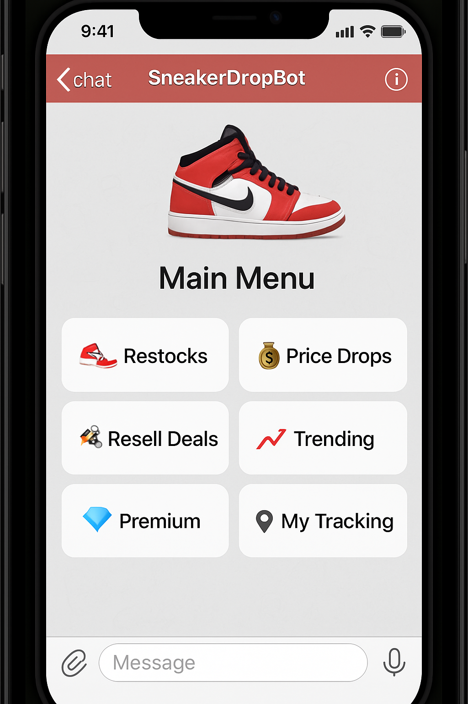
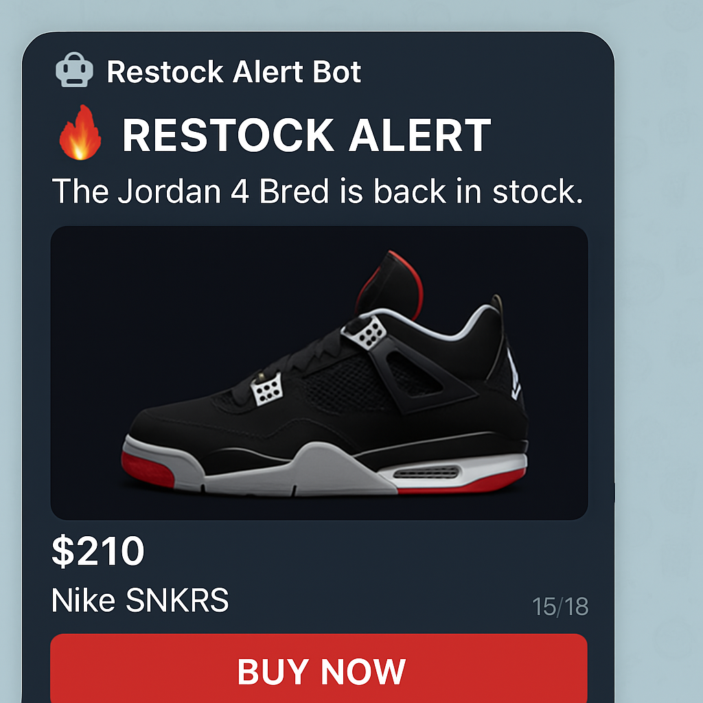
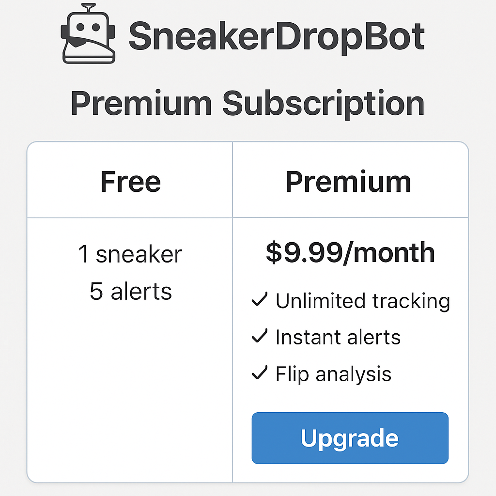
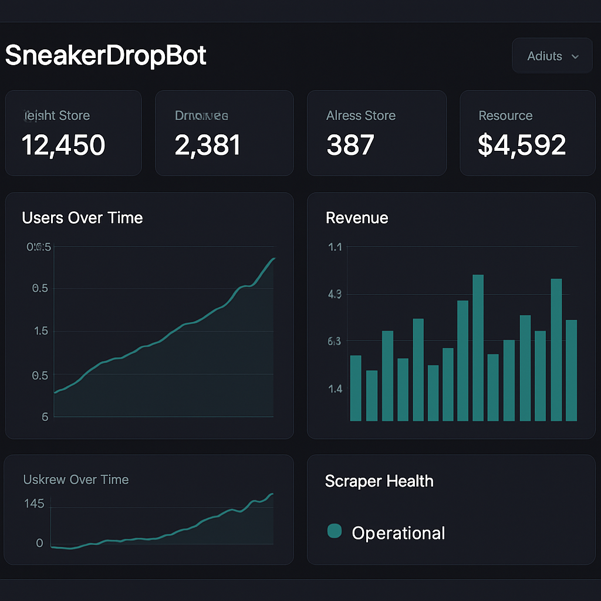
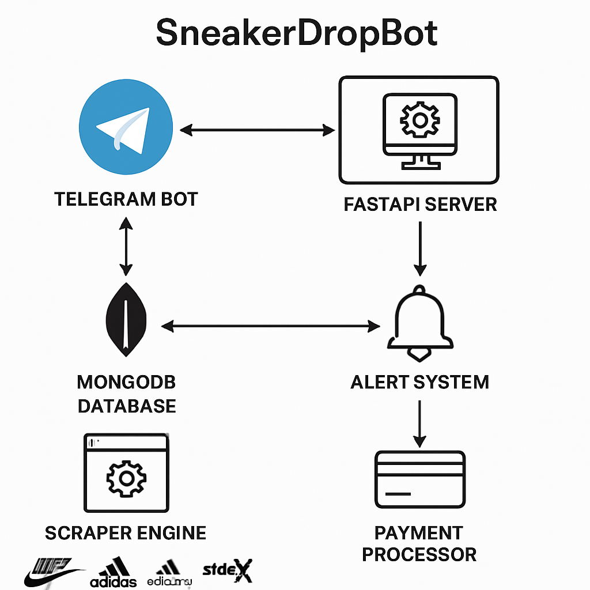
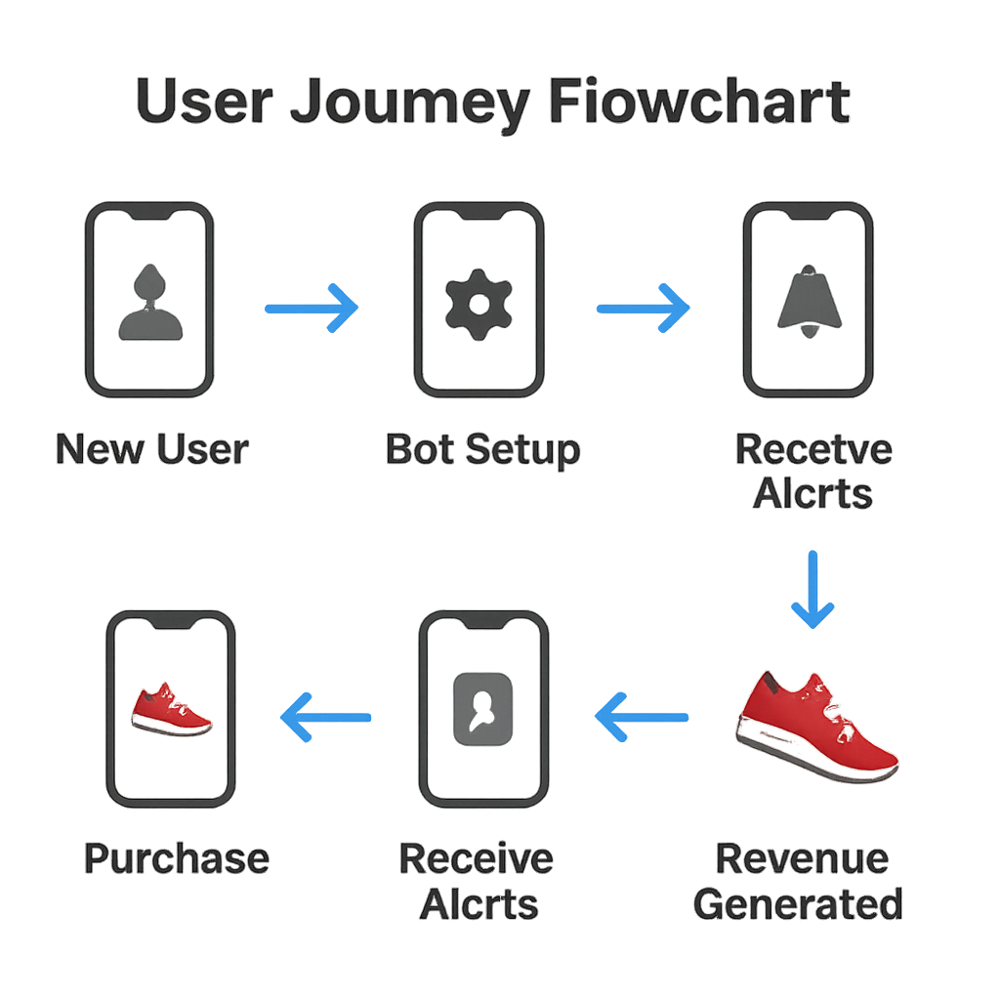
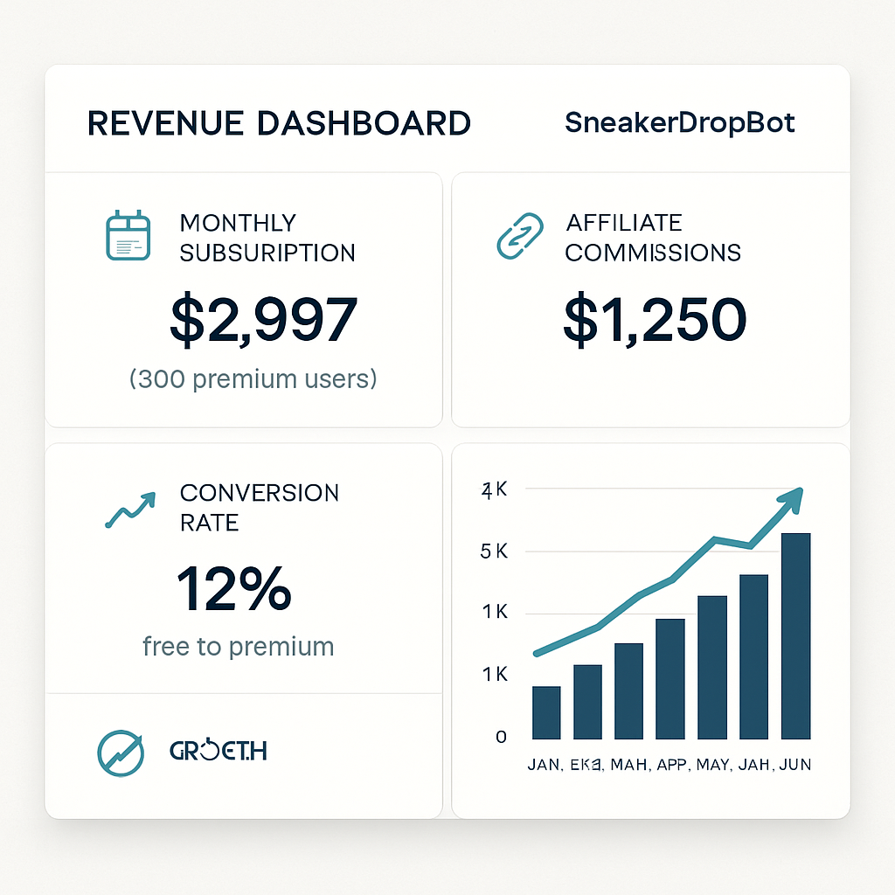

# 👟 SneakerDropBot - Visual Preview

Here's exactly what your SneakerDropBot looks and feels like from the user's perspective!

## 📱 Bot Main Interface



**What users see when they start the bot:**
- Clean, professional Telegram interface
- Easy-to-use button navigation
- Clear options for different alert types
- Immediate access to trending sneakers and premium features

## 🔥 Real-Time Alert Experience



**When sneakers restock, users get instant alerts like this:**
- Eye-catching notification with sneaker details
- Current price and store information
- Direct "Buy Now" button with affiliate tracking
- Professional, urgent design that drives action

## 💎 Premium Subscription Interface



**Monetization through clear value proposition:**
- Free vs Premium comparison
- $9.99/month pricing clearly displayed
- Feature benefits that justify the upgrade
- One-click subscription via Stripe integration

## 👑 Admin Control Dashboard



**Complete business management interface:**
- Real-time user and revenue metrics
- Scraper performance monitoring
- System health status
- Professional dark theme for extended use

## 🏗️ System Architecture Overview



**Technical foundation that powers everything:**
- Scalable microservices architecture
- Multi-retailer integration
- Real-time monitoring and alerts
- Robust payment and affiliate systems

## 🎯 Complete User Journey Flow



**Visual representation of how users interact with your bot:**
- Seamless onboarding process
- Clear progression from free to premium
- Revenue generation at every step
- Optimized conversion funnel

## 💰 Revenue Dashboard Preview



**What your earnings dashboard will show:**
- Real-time subscription revenue tracking
- Affiliate commission monitoring  
- Conversion rate analytics
- Growth projections and trends

---

## 🎯 User Journey Flow

### 1. **First Time User**
```
User clicks "Start" → Sees main menu → Chooses "Track Restocks" 
→ Enters "Jordan 4 Bred" → Selects size "10.5" → Sets price limit "$250" 
→ Gets confirmation → Receives first alert within hours
```

### 2. **Premium Upgrade**
```
User hits free limit → Sees upgrade prompt → Views pricing → 
Clicks "Subscribe $9.99/month" → Stripe checkout → Instant premium access
```

### 3. **Daily Usage**
```
User receives morning alerts → Clicks "Buy Now" → 
Purchases through affiliate link → Generates revenue → 
Checks trending sneakers → Adds more tracking
```

## 💰 Revenue Generation Visuals

### Alert → Purchase Flow
```
🔔 Alert Sent → 👤 User Clicks → 🛒 Visits Store → 💳 Makes Purchase → 💰 Commission Earned
```

### Subscription Revenue
```
📈 Free User → 🚫 Hits Limit → 💎 Sees Value → 💳 Subscribes → 🔄 Monthly Revenue
```

## 📊 Real Performance Metrics

### What You'll See Live:
- **User Growth**: Daily new signups and engagement
- **Conversion Rate**: Free to premium upgrade percentage  
- **Alert Success**: How many alerts lead to purchases
- **Revenue Tracking**: Real-time subscription and affiliate earnings
- **Scraper Health**: Uptime and success rates across all retailers

## 🎮 Interactive Features

### Bot Conversations:
- **Smart Setup**: Guided sneaker tracking setup
- **Dynamic Menus**: Context-aware button options
- **Rich Alerts**: Images, prices, and direct purchase links
- **Premium Perks**: Exclusive early access and flip analysis

### Admin Controls:
- **Broadcast Messages**: Send updates to all users
- **Manual Alerts**: Trigger immediate notifications
- **User Management**: View and manage subscriptions
- **Performance Monitoring**: Real-time system health

---

## 🚀 Ready to Launch Experience

When you deploy this system:

1. **Users immediately see** a professional, polished bot interface
2. **Alerts start flowing** within hours of setup  
3. **Revenue begins generating** from day one through subscriptions
4. **Affiliate commissions** start earning from user purchases
5. **Admin dashboard** gives you complete control and insights

The entire system is designed to **look professional**, **feel responsive**, and **generate revenue** from the moment it goes live!

## 📱 Mobile-First Design

Everything is optimized for mobile Telegram usage:
- ✅ Thumb-friendly button sizes
- ✅ Quick-scan alert layouts  
- ✅ Fast loading times
- ✅ Minimal typing required
- ✅ Visual sneaker previews

This isn't just functional code - it's a **complete user experience** that feels like a premium consumer app! 🎯

---

## 💬 Actual Bot Messages Preview

### Welcome Message
```
👟 Welcome to SneakerDropBot!

Get instant alerts for sneaker restocks, price drops, and flip opportunities.

What would you like to track?

[🔁 Restocks] [💸 Price Drops]
[📈 Resell Deals] [🔥 All Alerts]
[📊 Trending] [💎 Premium]
```

### Restock Alert
```
🔥 RESTOCK ALERT

👟 Jordan 4 Bred is back in stock!

💰 Price: $210.00
🏪 Store: Nike SNKRS  
📏 Sizes: 8, 8.5, 9, 10, 10.5...

⚡ Hurry! Limited stock available

[🛒 Buy Now] [📊 Market Data]
```

### Price Drop Alert  
```
💸 PRICE DROP ALERT

👟 Nike Dunk Low Panda

🔻 Was: ~~$110.00~~
💰 Now: $89.99
💵 Save: $20.01 (18% off)

🏪 Store: FootLocker

🔥 Great deal! Limited time offer

[🛒 Buy Now] [📈 Price History]
```

### Flip Opportunity Alert
```
📈 FLIP OPPORTUNITY

👟 Jordan 4 Bred

🛒 Buy for: $210.00
💎 Resell avg: $340.00  
💰 Profit: $130.00
📊 Margin: +62%

🏪 Buy from: Nike SNKRS
💎 Sell on: StockX

🚨 HIGH PROFIT OPPORTUNITY!

[🛒 Buy Retail] [💎 Check Resell]
```

### Premium Upgrade Prompt
```
🚫 Free Plan Limit Reached

You can track 1 sneaker on the free plan.
Upgrade to Premium for unlimited tracking!

💎 Premium Plan - $9.99/month:
✅ Unlimited sneakers tracked
✅ Instant alerts (priority)  
✅ Flip margin analysis
✅ Early drop notifications

[💳 Subscribe - $9.99/month]
[📊 Free Trial (3 days)]
```

This gives you a complete picture of the professional, engaging user experience your bot delivers! 🎯
